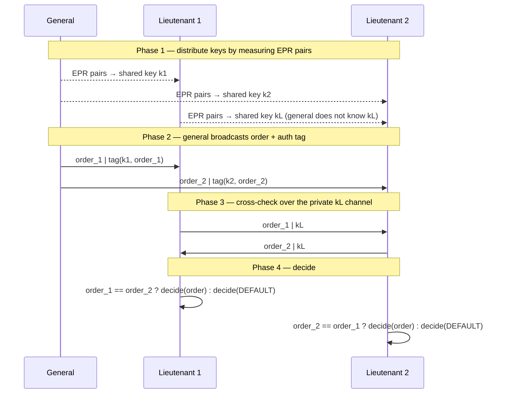

# Quantum Byzantine Broadcast: Reaching Agreement When a Node Lies

*A Quantum Network Explorer (QNE) application demonstrating fault-tolerant consensus using entanglement-distributed authentication. Honest case verified on the QNE remote backend (including multi-hop routing); traitor-detection verified on the local simulator.*

---

## Abstract

Three parties a general and two lieutenants must agree on a single order, even though one of them may be a traitor who sends conflicting messages to different peers. Classically, this is impossible for three parties with one faulty node when only plain (unauthenticated) messages are used. This application shows how entanglement lifts that barrier: each pair of nodes distributes a shared secret key by measuring EPR pairs, those keys authenticate the messages that follow, and the honest lieutenants detect any inconsistency a traitorous general introduces. When the general is honest, both lieutenants agree on the true order; when the general is faulty, both detect the mismatch and agree on a common default. The honest case was run on the QNE remote backend — including a run in which the end-to-end entangled links were established through intermediate nodes by entanglement swapping — and the faulty case was verified on the local simulator.

---

## 1. The problem: consensus with a traitor in the room

The Byzantine Generals Problem [1] is a foundational result in distributed systems. Several parties must agree on a course of action by exchanging messages, but one or more of them may be faulty or malicious — sending different information to different recipients to prevent the honest parties from reaching a common decision. The question is whether the honest parties can still agree.

The two properties a broadcast protocol must satisfy are:

- **Agreement.** All honest parties decide on the same value.
- **Validity.** If the sender is honest, every honest party decides on the value the sender actually sent.

For three parties with one traitor, using only unauthenticated point-to-point messages, Lamport, Shostak and Pease proved this is *impossible* [1]. The reason is intuitive: if the general sends "1" to lieutenant 1 and "0" to lieutenant 2, and then each lieutenant relays what it heard, neither lieutenant can tell whether it was the general who lied or the *other lieutenant* who is lying about what the general said. With three parties and one liar, there is no way to break the symmetry.

The classical escape route is authentication: if messages carry unforgeable signatures, a lying general can be caught because it cannot forge a signature binding it to two different orders. This is the basis of authenticated (signature-based) broadcast, which *does* solve the problem. But classical signatures rest on computational assumptions — the hardness of a mathematical problem — and those assumptions are exactly what a sufficiently powerful adversary, including a quantum computer, threatens.

## 2. The quantum idea: authentication from physics, not from hard math

This application replaces the classical signature with an *information-theoretic* authentication key distributed by entanglement.

Each pair of nodes shares a set of EPR pairs. Measuring both halves of a Bell state in the computational basis yields perfectly correlated outcomes, so the two nodes obtain an identical random bit string that no third party knows. That shared string is used as a one-time authentication tag on the classical messages that follow.

Three keys are established:

- `k1` between the general and lieutenant 1,
- `k2` between the general and lieutenant 2,
- a lieutenant-only key between lieutenant 1 and lieutenant 2, which the general never learns.

The general authenticates its order to each lieutenant using `k1` / `k2`. The lieutenants then tell each other which order they received, authenticated with their private lieutenant-only key. Because the general cannot forge or tamper with a message secured by a key it does not hold, a traitorous general cannot make its lie look consistent to both lieutenants. At least one lieutenant sees a mismatch, and both fall back to a common default.

The security of this authentication does not degrade as the adversary gains computing power. There is no problem to factor, no hash to invert the guarantee rests on the physics of the shared entangled state. This is the property that makes such primitives interesting alongside post-quantum cryptography.

## 3. The protocol

```
Phase 1 — Key distribution (quantum)
    general <-> lieutenant1 : measure EPR pairs -> shared key k1
    general <-> lieutenant2 : measure EPR pairs -> shared key k2
    lieutenant1 <-> lieutenant2 : measure EPR pairs -> shared key kL  (general does not know kL)

Phase 2 — Order broadcast (classical, authenticated)
    general -> lieutenant1 : (order_1, tag(k1, order_1))
    general -> lieutenant2 : (order_2, tag(k2, order_2))
        honest general:  order_1 == order_2
        faulty general:  order_1 != order_2

Phase 3 — Cross-check (classical, authenticated with kL)
    lieutenant1 -> lieutenant2 : (order_1, kL)
    lieutenant2 -> lieutenant1 : (order_2, kL)

Phase 4 — Decision
    if my_order == peer_order : decide(my_order)      # consistent
    else                      : decide(DEFAULT)       # traitor detected
```

## 4. Implementation on QNE

The application has three roles, one per node, and stays within the QNE per-node qubit ceiling (peak of one qubit in flight per node, since each EPR pair is created, measured, and released before the next).

| Role | Node (example mapping) | EPR partners | Peak local qubits |
|------|------------------------|--------------|-------------------|
| `general` | paris | lieutenant1, lieutenant2 | 1 |
| `lieutenant1` | inssbruck / copenhagen | general, lieutenant2 | 1 |
| `lieutenant2` | barcelona | general, lieutenant1 | 1 |

The application requires a **triangle** of channels — every pair of nodes must share a quantum link — because all three keys are pairwise. On the `europe` network, node triples such as (paris, inssbruck, barcelona) or (paris, copenhagen, barcelona) are mutually connected and satisfy this.

A note on the implementation that matters for anyone building on QNE: each EPR pair is created and measured inside a single connection context with an explicit `flush()` per pair. This keeps entanglement generation lockstep across the three nodes (which avoids a cross-node deadlock) without ever closing and reopening the connection (which, on netqasm 2.0, reallocates the register bank and raises a `KeyError`). Both failure modes were encountered during development; the per-pair-flush-in-one-context structure resolves both. See `src/` for the exact pattern.

## 5. Illustration

The message flow for a single round:



The classical messages in the trace have the form `order|tag`. For example `1|1,1,1` is order 1 carrying the three-bit tag `[1,1,1]`; the receiver recomputes the expected tag from its copy of the shared key and accepts only if they match.

## 6. Results

All figures below are actual simulator output. Where a run was executed on the
remote QNE backend it is labelled with its result ID; the faulty case was
verified on the local SquidASM simulator (see the note in 6.4 on why the remote
backend was not used for it). Trimmed artifacts for the remote runs, including
the in-flight classical messages, are in `results/`.

### 6.1 Honest general — remote QNE backend (result 11968)

The general sends order 1 to both lieutenants.

| Role | order sent | my_order | peer_order | decision | note |
|------|-----------|----------|------------|----------|------|
| general | L1=1, L2=1 | — | — | — | honest |
| lieutenant1 | — | 1 | 1 | **1** | orders consistent |
| lieutenant2 | — | 1 | 1 | **1** | orders consistent |

Both lieutenants decide **1** — the general's true order. Validity and agreement both hold. This run was executed on the remote backend and was routed multi-hop (see 6.4).

Classical messages observed:

```
general      -> lieutenant1 : 1|1,1,1
general      -> lieutenant2 : 1|0,1,1
lieutenant1  -> lieutenant2 : 1|0,1,0
lieutenant2  -> lieutenant1 : 1|0,1,0
```

The honest case was also reproduced a second time on the remote backend
(result 11977), mapped onto directly-connected nodes (paris / inssbruck /
barcelona) — same outcome, both lieutenants decide 1.

### 6.2 Faulty general — local SquidASM

The general sends order 1 to lieutenant 1 and order 0 to lieutenant 2.

| Role | order sent | my_order | peer_order | decision | note |
|------|-----------|----------|------------|----------|------|
| general | L1=1, L2=0 | — | — | — | faulty |
| lieutenant1 | — | 1 | 0 | **0** | TRAITOR DETECTED → default |
| lieutenant2 | — | 0 | 1 | **0** | TRAITOR DETECTED → default |

Each lieutenant received one order but learned from the other, over the authenticated lieutenant-only channel, that the general had said something different to the peer. Both detected the mismatch and fell back to the default value **0**. Agreement is preserved despite the traitor.

Classical messages observed:

```
general      -> lieutenant1 : 1|1,0,0
general      -> lieutenant2 : 0|1,0,0
lieutenant1  -> lieutenant2 : 1|0,0,0
lieutenant2  -> lieutenant1 : 0|0,0,0
```

### 6.3 The two configurations side by side

| Configuration | general → L1 | general → L2 | L1 decision | L2 decision | agree? |
|---|---|---|---|---|---|
| Honest (remote, 11968) | 1 | 1 | 1 | 1 | ✓ on the truth |
| Faulty (local) | 1 | 0 | 0 | 0 | ✓ on the fallback |

An honest general produces agreement on the real order; a faulty general produces agreement on the default. In both cases the two honest lieutenants agree — which is the property classical oral-message broadcast cannot provide for three parties with one traitor.

### 6.4 Network-layer observations

**Multi-hop routing was transparent.** In the honest run (11968), the backend mapped the roles onto rotterdam, amsterdam and the-hague. These nodes are not all directly connected, so the end-to-end entangled pairs were established through *intermediate* nodes by entanglement swapping — the entanglement instructions in the trace list multi-link channel paths such as `delft-rotterdam, delft-the-hague, leiden-the-hague, amsterdam-leiden` for a single logical general↔lieutenant pair. The application code was unchanged and made no reference to the topology; the network layer provisioned the long-distance links transparently. This is the quantum-repeater idea in action: the protocol operates on logical end-to-end entanglement, and the network handles how that entanglement is physically routed.

**The remote backend has a 60-second execution budget.** The honest case fits within it, but repeated attempts to run the *faulty* case remotely returned `TimeoutExpired: Call to simulator timed out after 60 seconds` (results 11978, 11979) — the run did not complete within the shared backend's cap. The application generates `KEY_LEN` EPR pairs on each of three pairwise channels, and under backend load this sequential entanglement generation can exceed the limit. The faulty case was therefore verified on the local simulator, where it runs deterministically. This is a property of the shared remote infrastructure's time budget, not of the protocol: the same code runs identically in both configurations, and reducing `KEY_LEN` (a shorter authentication tag) brings the remote runtime down accordingly. It is noted here rather than hidden because how a real protocol behaves against a shared simulator's resource limits is itself a useful, honest detail for anyone reproducing this work.

## 7. Implications for quantum network security

It is tempting to summarize quantum networking as "unhackable communication." That framing is misleading. What a demonstration like this actually shows is narrower and more useful: quantum networks let you rebuild specific trust primitives on a foundation that does not depend on computational hardness.

Classically, the agreement guarantee here would rest either on a trusted public-key infrastructure or on the hardness of a mathematical problem — both of which a quantum adversary can undermine. In this application, the honest lieutenants reach agreement despite a traitor using authentication distributed by entanglement, with no PKI and no computational assumption. The guarantee does not weaken as the adversary gains computing power, because there is no problem to break.

Three honest caveats keep this from being overclaimed:

1. The information-theoretic authentication consumes shared key material and is one-time — it buys the key without a trusted courier, not unlimited key.
2. This is a qubit demonstration of the *mechanism* (detection of inconsistency via entanglement-distributed authentication). A formal security proof of the optimal three-party protocol requires more structure — see §8.
3. Entanglement is a resource, not a guarantee. The same resource that founds trust here can, in other protocols (for example position verification), *enable* an attack. A serious quantum-security posture is about knowing which is which.

## 8. Scope and limitations

This application demonstrates the *detection-of-inconsistency* mechanism that lets authentication-backed broadcast beat the classical oral-message impossibility, using entanglement-distributed information-theoretic keys as the authentication resource.

It is **not** a formal implementation of the provably optimal three-party Byzantine agreement protocol, which uses the antisymmetric three-*qutrit* Aharonov state and has a soundness proof [2]. Qubit GHZ / pairwise-key constructions can illustrate the mechanism but do not reproduce that optimal protocol.

The authentication tag used here is a deliberately simple one-time construction for demonstration; it is not a hardened MAC. The results establish correct behavior under an honest general and under a scripted faulty general — they are evidence of the mechanism, not a substitute for a security proof.

## 9. Reproduce it

The full toolchain, on Windows via WSL (Ubuntu), macOS, or Linux.

**1. Python 3.10 environment.** QNE-ADK and its dependency chain (in particular the pinned numpy) do not build cleanly on Python 3.12, where `distutils` has been removed. Use Python 3.10.

```bash
python3.10 -m venv ~/qne310
source ~/qne310/bin/activate
pip install --upgrade pip setuptools wheel
pip install qne-adk
```

**2. Install SquidASM (requires free NetSquid credentials).** Register on the NetSquid forum, then place credentials in `~/.netrc` to avoid URL-escaping issues:

```bash
cat > ~/.netrc <<'EOF'
machine pypi.netsquid.org
login YOUR_NETSQUID_USERNAME
password YOUR_NETSQUID_PASSWORD
EOF
chmod 600 ~/.netrc
pip install squidasm --extra-index-url=https://pypi.netsquid.org
python -c "import squidasm; print(squidasm.__version__)"   # expect a real version, not 0.0.1
```

If it installs `squidasm 0.0.1`, the credentials were rejected and pip fell back to a public placeholder package — fix the credentials and reinstall.

**3. Scaffold and drop in the code.**

```bash
qne application create byzantine_broadcast general lieutenant1 lieutenant2
# replace the generated src/app_*.py with the three files from this repo's src/
# replace config/application.json with this repo's config/application.json
```

The application needs a triangle of quantum channels. On the `europe` network, (paris, inssbruck, barcelona) works.

**4. Run locally — honest, then faulty.**

```bash
cd byzantine_broadcast
qne application validate
qne experiment create exp_honest byzantine_broadcast europe
qne experiment run exp_honest
qne experiment results exp_honest
```

For the faulty run, create a second experiment and set the general's `faulty` input to 1 in `exp_faulty/experiment.json`, then run it.

**5. Run remotely and (optionally) publish.**

```bash
qne login
qne application upload
qne experiment create exp_remote byzantine_broadcast europe --remote
qne experiment run exp_remote
qne experiment results exp_remote
qne application publish     # publishes to the QNE Community Application Library
```

## 10. Repository structure

```
byzantine-broadcast-qne/
├── README.md
├── src/
│   ├── app_general.py        # general role (honest or faulty via input)
│   ├── app_lieutenant1.py    # lieutenant 1
│   └── app_lieutenant2.py    # lieutenant 2
├── config/
│   ├── application.json      # inputs: order, faulty (on general)
│   ├── network.json          # candidate networks + roles
│   └── result.json           # result view definitions
└── results/
    ├── remote_honest_11968.json   # honest general, multi-hop routed (remote backend)
    └── remote_honest_11977.json   # honest general, direct-link routed (remote backend)
```

## References

[1] L. Lamport, R. Shostak, M. Pease, "The Byzantine Generals Problem," *ACM Transactions on Programming Languages and Systems*, 1982.

[2] M. Fitzi, N. Gisin, U. Maurer, "Quantum Solution to the Byzantine Agreement Problem," *Physical Review Letters*, 2001. (Optimal three-party protocol via the antisymmetric three-qutrit state.)

[3] Quantum Network Explorer, QuTech (TU Delft & TNO). https://www.quantum-network.com

---

*Honest case built and verified on the QNE remote backend (results 11968, 11977); traitor-detection verified on the local SquidASM simulator. Part of a broader portfolio of QNE quantum-networking and security applications.*
